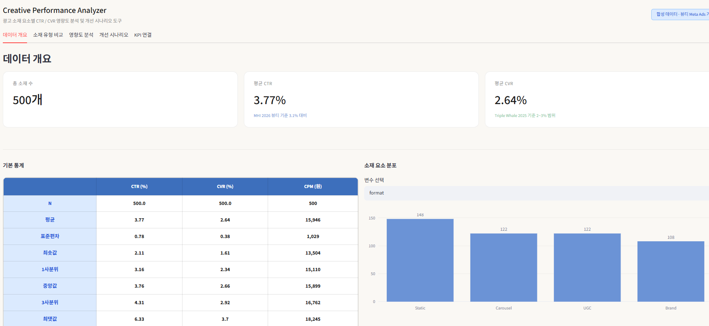
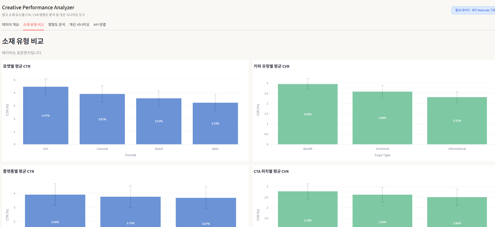
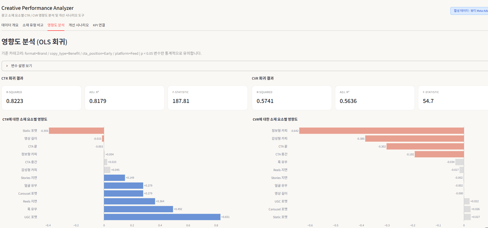
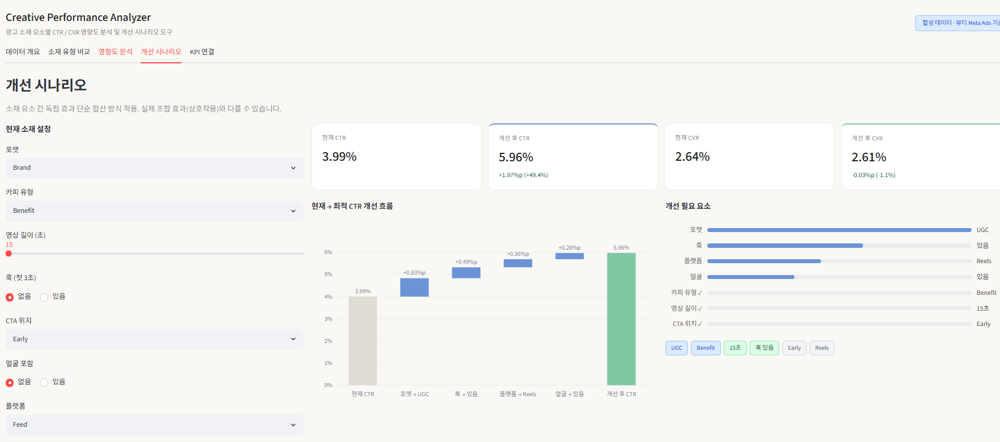
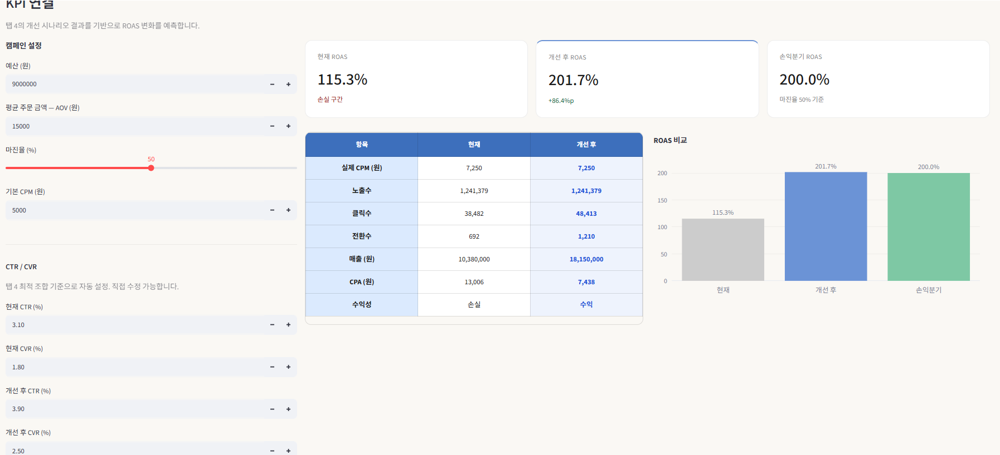

# Creative Performance Analyzer

> 광고 소재 요소별 CTR / CVR 영향도 분석 및 개선 시나리오 도구

🔗 **[라이브 데모 바로가기](https://creative-performance-analyzer.streamlit.app/)**

---

## 프로젝트 소개

퍼포먼스 마케터는 광고 성과를 CTR, CVR 단위로 측정하지만, **어떤 소재 요소가 그 수치를 만드는지** 구조적으로 분석하기 어렵습니다.

이 도구는 소재 요소(포맷, 카피 유형, 영상 길이 등)를 변수로 분해하고, 회귀분석과 그룹 비교로 각 요소의 영향도를 정량화합니다. 분석 결과는 개선 시나리오 생성과 ROAS 예측까지 연결됩니다.

**"지금 소재에서 무엇을 바꾸면 성과가 얼마나 달라지는가"** 에 대한 데이터 기반 답을 제공합니다.

---

## 주요 기능

### 탭 1 — 데이터 개요
합성 데이터 기본 통계 및 소재 요소 분포 확인

---

### 탭 2 — 소재 유형 비교
포맷, 카피 유형, 플랫폼, CTA 위치별 CTR/CVR 평균 비교

---

### 탭 3 — 영향도 분석
OLS 회귀분석으로 소재 요소별 CTR/CVR 영향도 정량화

- 기준 카테고리: `format=Brand` / `copy_type=Benefit` / `cta_position=Early` / `platform=Feed`
- p-value < 0.05 변수만 통계적으로 유의

---

### 탭 4 — 개선 시나리오
현재 소재 설정 입력 → 최적 조합 자동 제안 → CTR 개선 Waterfall 시각화

---

### 탭 5 — KPI 연결
개선된 CTR/CVR을 기반으로 ROAS 변화 예측

---

## 데이터 및 분석 방법

### 데이터
업계 벤치마크 기반 합성 데이터 500행 (뷰티 카테고리 Meta Ads 기준)

| 기준값 | 출처 |
|--------|------|
| CTR 기준 3.1% | MHI Growth Engine 2026 — 뷰티 카테고리 Instagram Stories |
| CVR 기준 2.5% | Triple Whale 2025 — 뷰티/패션 CVR 2~3% 중간값 |
| UGC CTR 최대 45% 개선 | Billo.app 2026 |
| 15초 이하 영상 CTR 31% 우위 | MHI Growth Engine 2026 |

### 분석 방법
- **그룹 비교**: 소재 요소별 CTR/CVR 평균 및 표준편차 시각화
- **OLS 회귀분석**: 범주형 변수 더미화 후 각 요소의 계수 추출
- **개선 시나리오**: 현재 소재 대비 최적 조합의 요소별 개선량 계산 (독립 효과 합산)
- **KPI 예측**: 개선된 CTR/CVR → 노출수, 전환수, 매출, ROAS, CPA 계산

---

## 기술 스택

| 구분 | 사용 기술 |
|------|----------|
| 언어 | Python 3.14 |
| 웹 프레임워크 | Streamlit |
| 데이터 처리 | Pandas, NumPy |
| 통계 분석 | Statsmodels (OLS) |
| 시각화 | Plotly |
| 배포 | Streamlit Cloud |

---

## 한계 및 해석 범위

- **합성 데이터 기반** — 절대값보다 방향성(어떤 요소가 더 중요한가) 해석에 활용
- **독립 효과 합산 가정** — 소재 요소 간 상호작용 효과 미반영, 실제 조합 효과와 다를 수 있음
- **글로벌 벤치마크 기준** — 참고 데이터가 Meta 글로벌 기준, 한국 시장과 수치 차이 있을 수 있음
- **뷰티 카테고리 한정** — 기본값 설계 기준이 뷰티/코스메틱, 타 카테고리 적용 시 기준값 조정 필요

---

## 향후 계획

- **v2** — 패션, 이커머스 등 카테고리 선택 기능 추가
- **v3** — 실제 광고 데이터 입력 기반 분석 지원
